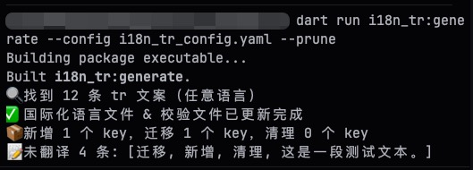
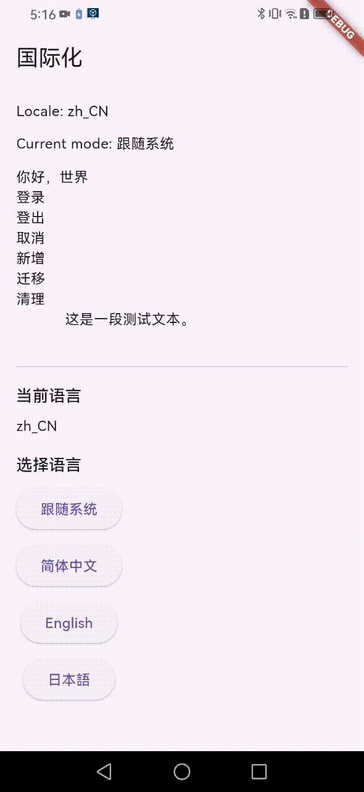

# i18n_tr

一个用你熟悉的母语文案来做国际化的 Flutter 插件。开发时直接写 `tr("中文文案")`，生成器会把文案收集成语言包，并提供运行期切换与参数替换。

[](https://pub.dev/packages/i18n_tr)

<p align="center">
  
  
</p>

## Features

- 直接用原文案作为 key（例如中文），无需手写 key
- `dart run i18n_tr:generate` 自动提取文案并生成语言包
- `dart run i18n_tr:generate --config i18n_tr_config.yaml --prune` 同上，可增加配置，--prune表示删除无用的key
- 运行期切换语言，支持参数占位替换
- 使用 `_source_text.dart` 做校验与反查，避免 key 丢失

## Getting started

在你的应用中添加依赖（建议 path 依赖）：

```yaml
dependencies:
  i18n_tr: 0.0.4
```

配置 `i18n_tr`（在应用的 `pubspec.yaml`）：

```yaml
i18n_tr:
  project_lib: lib
  i18n_dir: i18n_tr/lib/i18n
  #source_file: i18n_tr/lib/i18n/_source_text.dart # 可选，配置文件放置位置
  #config_file: i18n_tr/lib/i18n_config.dart # 可选，配置文件放置位置
  source_locale: zh_CN # 可选
  fallback_locale: zh_CN # 可选
  system_label: 跟随系统 # 可选
  langs:
    - locale: zh_CN
      label: 简体中文
      file: zh_cn.dart
      map: zhCN
    - locale: en_US
      label: English
      file: en_us.dart
      map: enUS
    - locale: ja_JP
      label: 日本語
      file: ja_jp.dart
      map: jaJP
  prune_unused: true # 可选，默认false，删除无用的key
  migrations: # 可选，文案迁移，不改变Key，旧文案->新文案
    - from: 旧文案
      to: 新文案
```

运行生成器：

A) 在 pubspec.yaml 添加配置，并运行：
```bash
dart run i18n_tr:generate
```
B) 或创建 i18n_tr_config.yaml 添加配置，并运行：
```bash
dart run i18n_tr:generate --config i18n_tr_config.yaml
```

## Usage

初始化与切换语言：

```dart
import 'package:i18n_tr/i18n.dart';

void main() async {
  await I18n.instance.init(config: i18nConfig); // 初始化传入生成的i18n_config中的i18nConfig（后续命令直接生成）
  runApp(const MyApp());
}
```

在代码里直接使用文案：

```dart
Text(tr('国际化'));
Text(tr('当前语言'));
Text(tr('English'));
Text(tr('你好，{name}', {'name': tr('世界')}));
```

绑定到 `MaterialApp`：

```dart
AnimatedBuilder(
  animation: I18n.instance,
  builder: (context, _) {
    return MaterialApp(
      locale: I18n.instance.locale,
      supportedLocales: I18n.instance.supportedLocales,
      localizationsDelegates: const [
        GlobalMaterialLocalizations.delegate,
        GlobalWidgetsLocalizations.delegate,
        GlobalCupertinoLocalizations.delegate,
      ],
      home: const HomePage(),
    );
  },
);
```

切换语言：

```dart
I18n.instance.change(mode);
// 插件内自行保存。也可以自行保存mode.name到本地，下次启动时读取I18n.instance.init(languageName:modeName);
```

`mode` 可以从 `I18n.instance.modes` 里获取。

## Generated files

- `/lib/i18n/zh_cn.dart` 等语言包
- `/lib/i18n/_source_text.dart` 文案校验与反查 Map
- `/lib/i18n_config.dart` 运行期配置（`I18nRuntimeConfig`）

## Example

仓库内有示例应用：`example/`  
运行方式见 `example/README.md`。

## Notes

- 建议不要直接修改生成的文件，统一通过生成器更新
- 若文案变动导致 key 冲突，生成器会报错提示
